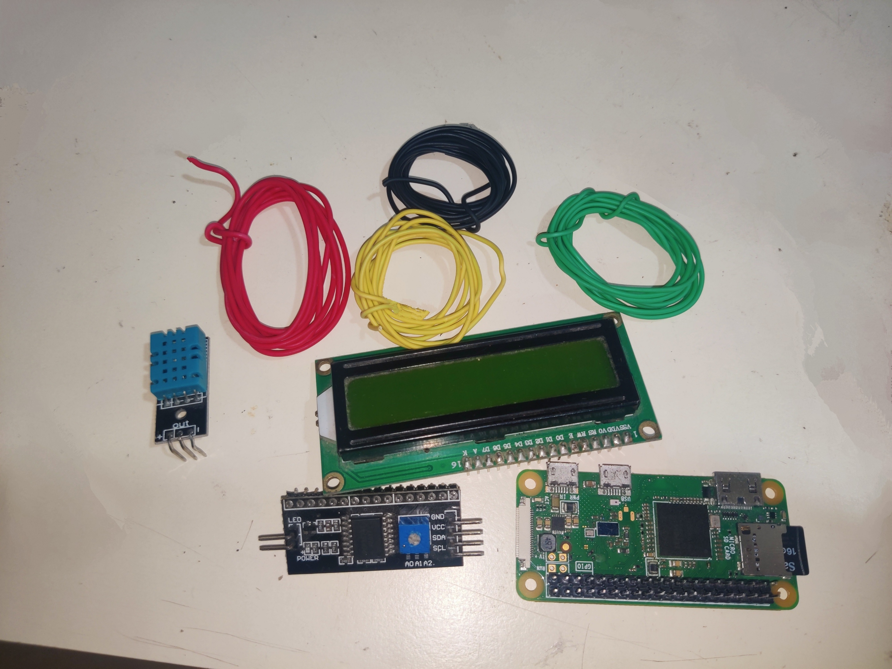
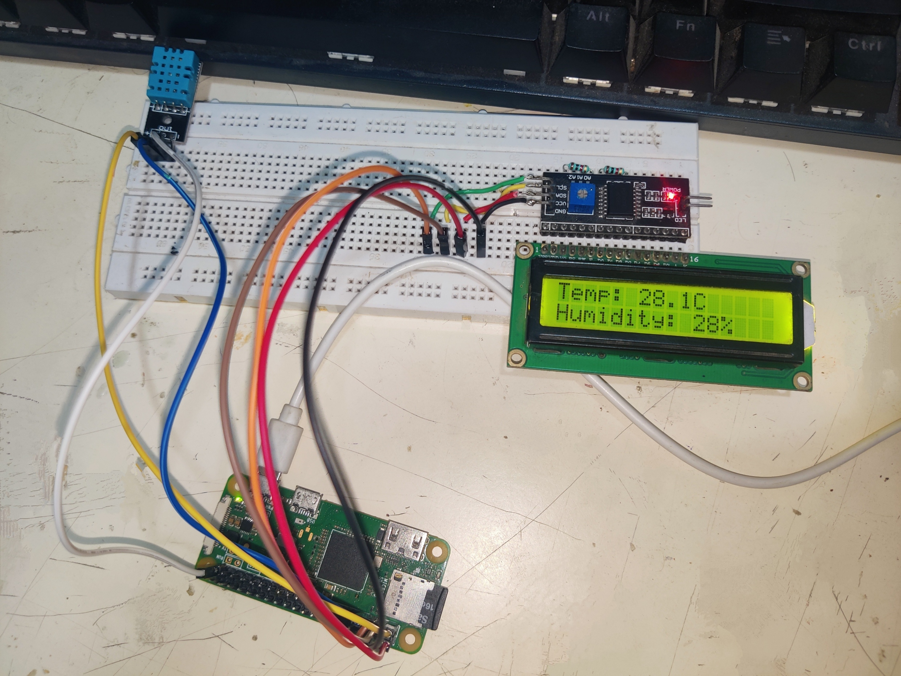
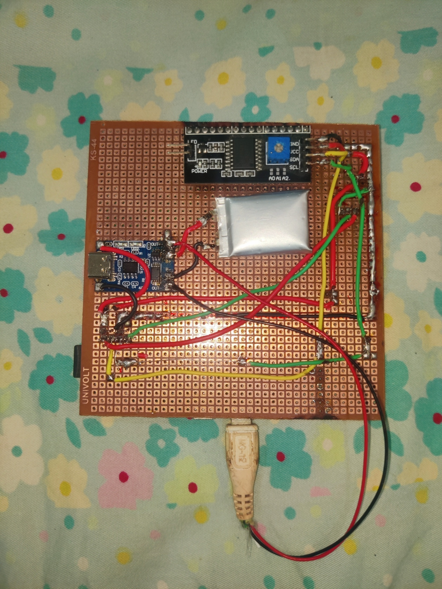

# 🌡️ DHT11 + 16x2 LCD on Raspberry Pi Zero W

This project reads **temperature and humidity** data using a **DHT11 sensor** and displays it on a **16x2 LCD** via **I2C**, all powered by a **Raspberry Pi Zero W**.

---

## 📦 Components Used



### Required:
1. 🧠 Raspberry Pi (any model, tested on Pi Zero W)
2. 🌡️ DHT11 Temperature & Humidity Sensor
3. 🖥️ 16x2 LCD Display with I2C adapter

### Optional (for portable use):
4. 🔋 TP4056 Li-ion Battery Charging Module
5. 🔋 3.7V Li-ion Battery (e.g., 18650 or flat cell)

---

## 🛠️ How It Works

- The **DHT11 sensor** reads temperature and humidity every few seconds.
- The data is then printed to a **16x2 LCD** using the I2C protocol.
- The entire system can run off a battery using the **TP4056 module** for charging and protection.

---


## 🔧 Wiring Guide

✨ DHT11 Sensor

VCC → GPIO Pin 1 (3.3V)

DATA → GPIO Pin 7 (GPIO4)

GND → GPIO Pin 6 (GND)

🔢 16x2 I2C LCD

GND → GPIO Pin 6

VCC → GPIO Pin 2 (5V)

SDA → GPIO Pin 3 (GPIO2)

SCL → GPIO Pin 5 (GPIO3)

## TEST on breadboard first

After making all the connections, the LCD should light up when you power on the Raspberry Pi.
This means there is no error in the connection. 
Now, let us configure all the components on the Raspberry Pi.

## configuration on Raspberry Pi

After flashing the os on the SD card for Raspberry Pi

For SSH connection, you have to  create two files on the SD card ( same partition)

[SSH_Files_to_paste](pi_headless_SSH_setup)

You can paste directly into the SD card 

Just change ssid and password to yours in the file "wpa_supplicant.conf"

To check if the Raspberry Pi is connected,

Open CMD on the PC (connected to the  same wifi)

Run `arp -a` to check IP addresses connected to the network

Now, after connecting to the Pi, let's set up software.

### Software setup

1. Enable I2C on Raspberry Pi
`sudo raspi-config`
Go to Interfacing Options > I2C > Enable
`sudo reboot`
2. Install Required Libraries
    ```bash
   sudo apt update
   sudo apt install -y python3-pip i2c-tools
   pip3 install adafruit-circuitpython-dht flask RPLCD smbus2
   sudo apt install libgpiod2
    ```
Detect LCD I2C Address

Run this in the terminal: `i2cdetect -y 1`

You should see something like 0x27 or 0x3F. Note this address.

### Python script  

Run `nano dht_lcd_display.py`

Then paste this Python code

[python_code](python_script.py)

Now run this script

`python3 dht_lcd_display.py`

Your LCD should now begin showing temperature and humidity updates every 5 seconds.

Practically, this project is finished.

## In breadboard it should look like this



## solder to the zero circuit board



# Finished project

.jpg)
